# 正文
作者：wangyun

## 什么是语音识别？
狭义定义：
语音->文字

相关课题：
- 元数据识别：语种，说话人信息
- 语音增强和分离
- 语音合成转换：文字->声音
- 自然语言理解：对话

## GMM + HMM 
八十年代，李开复老师创造。

## 孤立词的识别

Q：

【Yes】: Wave1 | 【No】: Wave2
现在有一个新的波形：Wave3
如何判断它是yes还是no？

A：

- 模板比较法：计算距离，d(Wave1,Wave3),d(Wave1,Wave3)
- 但还需要特征识别

### 特征提取

#### 第一步
变化的信号 -> 分成小段，叫做帧

一帧的信号，通常为20～50ms
一帧要在一个音速之内。

Q：为什么是20到50ms
A：微观上足够长，包含2到3个周期。一般人说话频率是100Hz，即0.01s=1ms/周期，多选择几个周期，完整

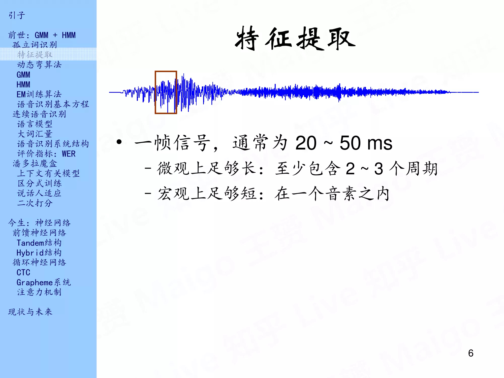

#### 第二步
傅里叶变换

分析一帧信号的频谱，其中频谱具有精细结构和包罗。

精细结构：小峰，反映音高，用处较小。（在中文中可以体现声调）

包络结构：反映音色，主要信息。里面的高峰，叫做共振峰，反映的是音色。

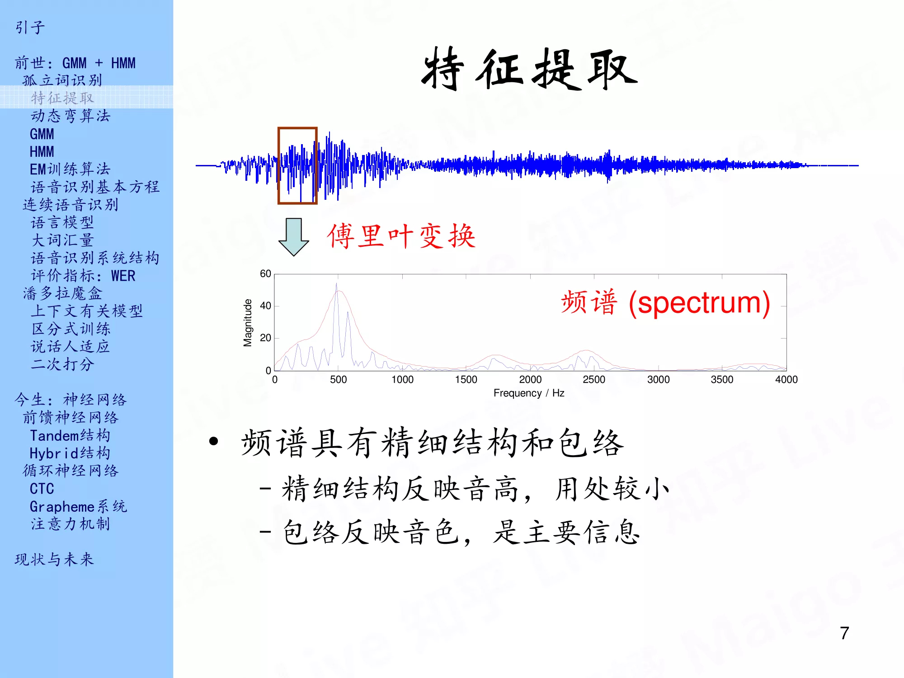

#### 第三步
忽略小峰，在傅里叶基础上使用三角滤波，得到Filterbank Output(近似包络)。

三角滤波的作用是，获得每个三角形内部的总能量。

在输出的图像中，如果越高，意味着能量越多。

Q：三角滤波，左边密集，右边稀疏？
A：人类低频敏感，多取低频

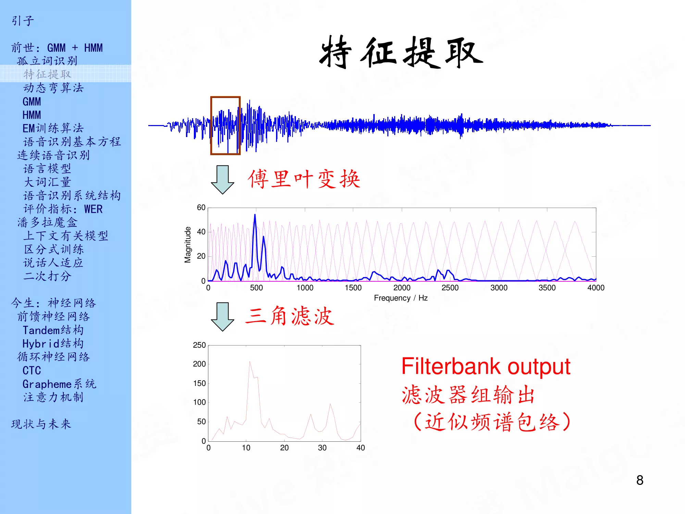

#### 第四步
取对数，离散余弦变换（Log，DCT）

四十多个三角滤波的结果，太多，使用这个操作，得到更少的表示向量，叫做MFCC。

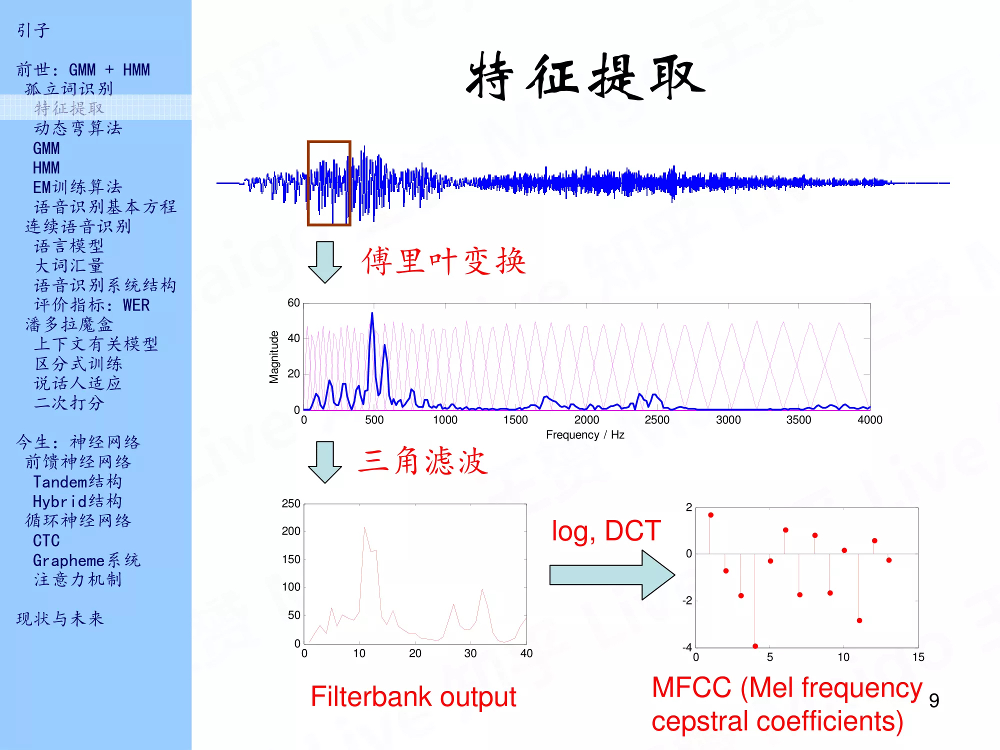

#### 第五部

重叠取帧，20～50ms/frame，frame之间距离是10ms。一般1s，100frames。

每一帧傅里叶变换，可以的到 语谱图。横轴是frame的编号，纵轴是frequenze的能量情况。

获得MFCC序列。

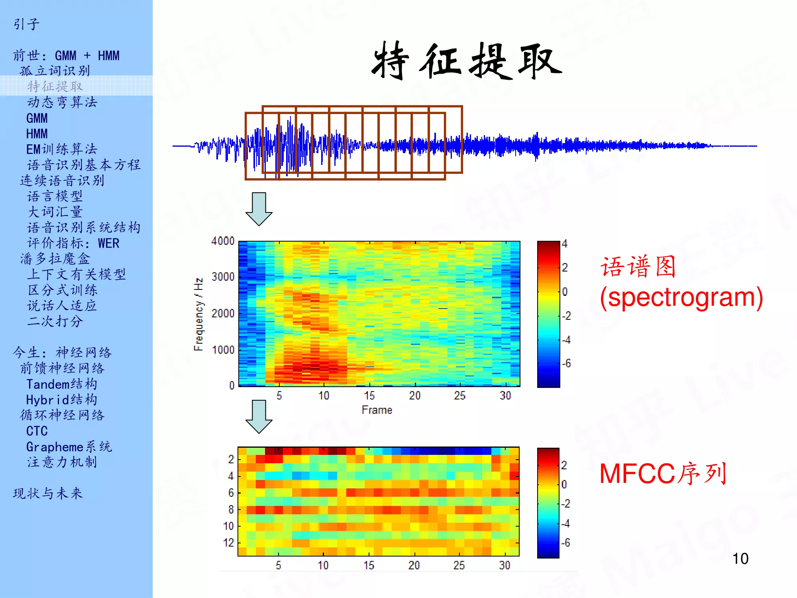

#### 总结

- MFCC：包络，低频。但是视野小，context不明确。受到噪声和滤波影响严重。
- 改进：加入一，二阶差分，归一化。

### 动态弯算法

DTW

待识别的每一帧，与模板中的最相似的帧匹配，使用动态规划，保持顺序。

使用sum欧式距离。

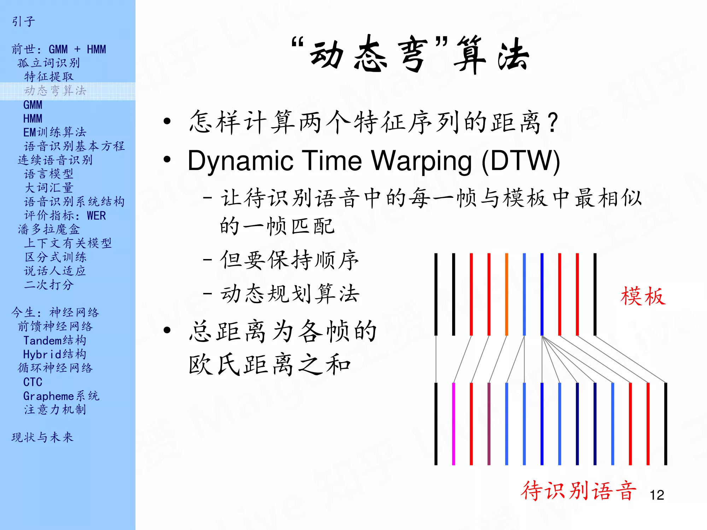

### GMM

一个词，也许有多个模板（每个模板有很多特征向量）。通过对每个模板中，类似特征向量的归类，得到模型。

Q： 在训练模型方法的时候，需要切分成多个段落，如何切？
A： 使用高斯分布的叠加，拟合每段中（每种归类）特征向量的分布。

Q： 如何用 训练好的模型，识别未知语音？
A： 用DTW 对其 待识别 和 模型。

- 用GMM的概率密度 代替 欧式距离
- 相乘得到 P（代识别|模型）

### 前世 HMM 隐Markov模型

HMM的目的，将模型完全概率化，方便计算
P（语音，对齐方式|模式）= GMM观测概率 * HMM转移概率
特点：

- 隐：特征序列是由因状态产生的，对齐方式是未知的
- 马尔科夫：转移概率和观测概率只有当前状态决定，状态的持续时间服从指数分布
- 模型参数：转移概率，观测概率，模型单向，无初始概率

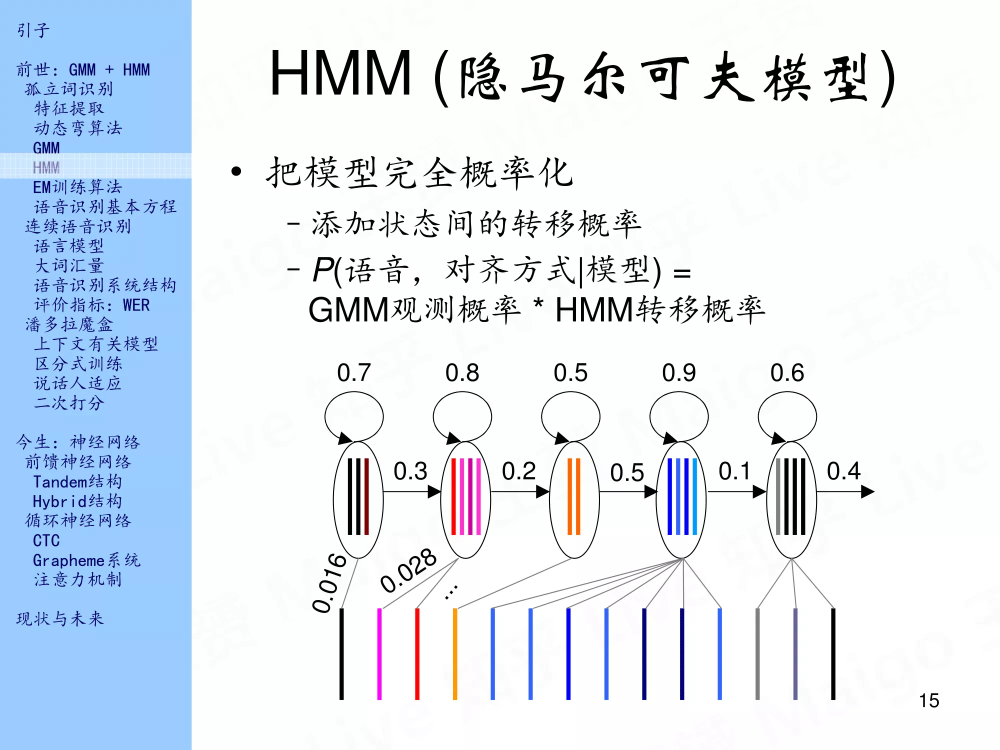

#### HMM三大问题

1. 求值：给定模型的参数和语音，意思是已经有一个训练好的模型和一段语音，计算P（语音|模型）
   - 枚举所有的对齐方式，将 P(语音?，对齐\*|模型\*)（观测x转移） 对所有对齐方式求和
   - 动态规划算法 Forward algorithm，每一个单词有一个模型，有一个待测语音以后，我们对每个模型都计算一个概率，以那个模型为前提的概率是最大的，就是识别结果。
2. 解码：给定模型参数和语音，最佳对齐方式是什么，让语音和对齐方式的联合概率最大的对齐方式。P（语音\*，对齐?|模型\*）
   - Viterbi decoding，它是 DTW 升级版
   - “最佳对齐概率，可以作为总概率近似”，对齐方式，有很多种，最佳对齐却能成为总概率，因为不是最佳对齐的概率，太小，忽略。
   - 在连续语音识别中，和hmm的训练中，有用。
3. 训练：给定语音和结构模型，求模型参数。YES -> ye e s 如何训练？P（语音\*，对齐\*|模型？）

#### 如何训练模型？ EM
一方面：
已知 每一帧特征 和 对应的音素状态，如何对其的，求模型参数很容易。
具体做法，我知道 一群帧（状态向量），是对应ye这个音素的，将这群向量集合起来，拟合一个高斯混合模型，作为该 音素 的模型。

但，我们不知道对应方式。

另一方面：
如果我们知道 模型参数，就容易算对齐。
例如，已知模型参数，就可以找到最佳最低对齐方式。

Q：如何解？
A：
1. M步骤：盲猜一种方式，例如均匀对齐，前五帧是ye，中五帧是e，后五帧是s。不准确，但是猜测。于是，我们知道每一帧（通过语音裁出的）对应的是什么状态（相似向量集合），求出模型参数。
2. E步骤：已知了模型参数，就可以更新对齐方式了。Viterbi可以使用，实际使用 前后项。
3. 循环

-> 最大似然估计：最大化 P(训练语音|模型)

#### 语音识别基本方程

$$
W^{*}=argmax_{W}P(W|X)=argmax\frac{P(X|W)\cdot P(W)}{P(X)}
\\= argmax_{W}P(X|W)P(W)
$$

W：任意单词。

X：待识别的信号。

P（W|X）：在已知待识别信号的情况，希望获得最大可能的W。意思是说，从众多单词中，挑选出能够让 已知X时候，最可能的那个单词。

P（X|W）：声学模型。给定单词以后，发出这个声音的概率有多大？这个单词可以是很多很多单词。

P（W）：单词的先验概率。例如，一个包子经常说yes，很少说no，那么这个yes先验就很大。yes说完了，如果对方没听清，意思是声学模型没给你什么信息，于是就要结合先验概率。

### 答疑Q&A

Q： GMM是对 音素 还是 状态 建模？

A：实际中，每个音素  会对应 多个状态，一般是三个。

Q：观测概率（发射概率是如何计算的）？

A：GMM是由很多高斯混合而成，每一个高斯都有mean和variances，还有pi（权重）。在每一个高斯分量上，计算概率密度，加权平均。

Q：音素和音素之间是如何处理的？

A：无空隙，就不需要处理。

## 连续语音识别

将上述的Bayes的W看成是句子，P（X|W）是句子的声学模型，P（W）句子的先验概率。（是否像一句话）

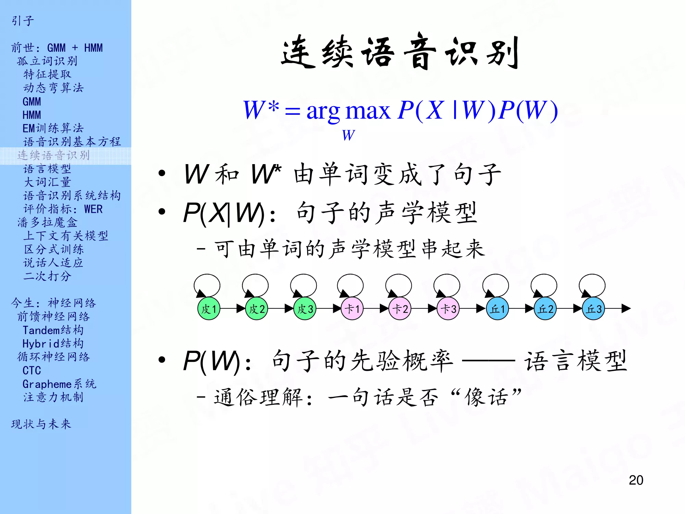

### 语言模型

- 链式法则：P（皮卡皮卡丘）=P（皮） * P（卡|皮）* P（皮|皮卡）* P（卡|皮卡皮）用之前的信息，猜测下一个字。
- n-gram模型，每个词只和前n-1个词有关系。
  - bingram
  -	Trigram
- 其它形式：最大熵，神经网络...

- Bigram是马尔科夫模型：下一个词只和上一个次有关系。

但这个仅仅是词中的转换，现在还要在词和词中间在进行转换。例如皮123卡123丘123，皮->卡 的时候，皮3 有可能直接跟着 卡1，有可能回去了（皮1），也有可能跳到了丘（丘1），不一定，因此需要根据 转移概率进行分配。

例如 皮3 -> 皮3 的概率是 0.6，从 皮3 到 其他状态 的概率就是 0.4，我们已知，从 皮->卡 的概率是0.5，那么对应的，就可以计算得到 皮3->卡1的概率，0.4 x 0.5 = 0.2。
通过将 小词内状态 和 大词外状态 的结合，可以得到 不同大词的小词状态转移概率。

哪条路径最佳，就用哪个模型->一句话的识别结果。

### 大词汇量语音识别

词汇量太大，就是用音素训练，每个音素训练一个HMM。

例如：p音素，包含三个状态，p1p2p3，形成一个小的HMM。
使用词典，将音素和拼接好的单词相互对照：单词，皮，音素，p-i，HMM状态，p1-p2-p3-i1-i2-i3

HCLG：HMM Context Lattice Gramma

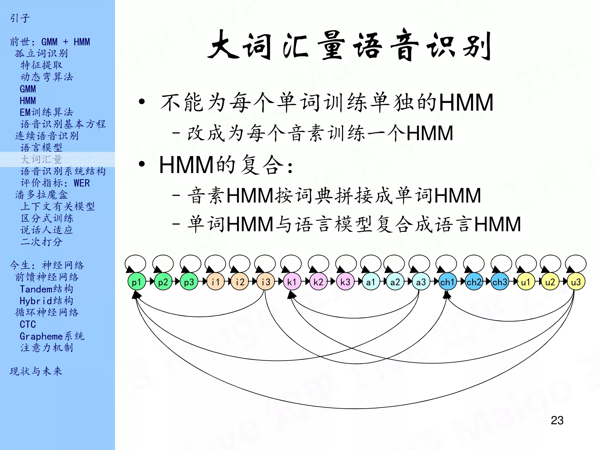

#### 大词汇语音识别
训练
- 给定许多的语音和对应的音素串，求模型算法，例如hello world，对应音素串h-e-l-o-w-o-rl-d（示例，不准确）。
- 每个音素串的模型是单向的，仍旧是EM 算法。不需要语言模型。对齐-模型参数-对齐-模型参数----

解码
- 给定 一门语言的HMM （语言模型，词典，声学模型）和 一条语音，求单词串。
- 长图，用viterbi ，计算最佳路径，得到最大概率，同时需要剪枝（beam search），如果某条分支相比最佳路径差好几个数量级的时候，就需要剪掉（为什么不只保留最佳路径？）
- 最佳路径，是识别结果。除了最佳，保留次有，以防万一。每一个路径都可以解码出单词串来，成为n-best-list或lattice

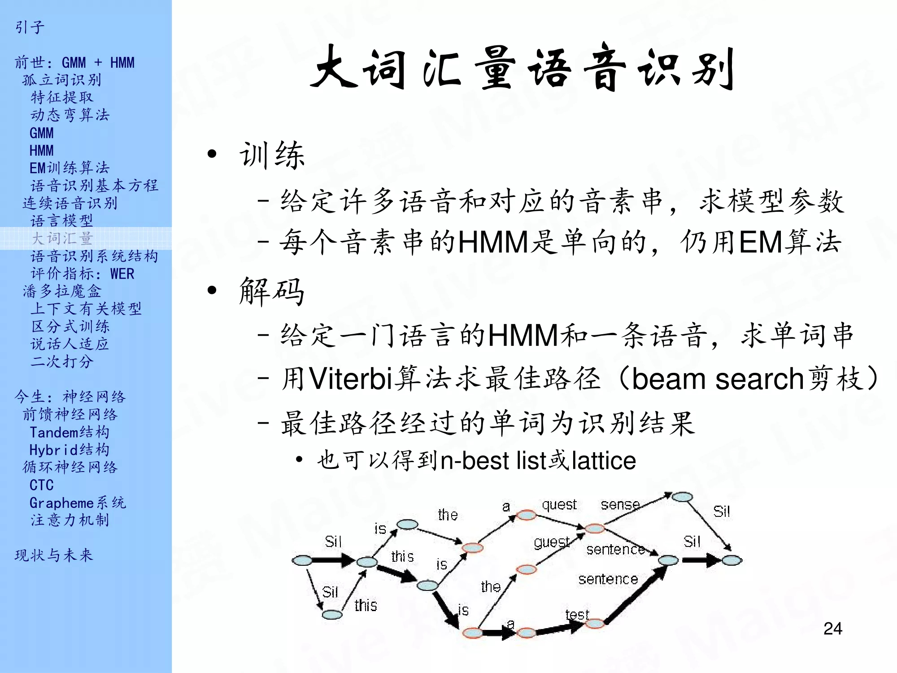

### 语音识别系统结构

语音信号 -> 特征提取 -> 解码器 -> 识别结果
语音信号 -> MFCC  -> 声学模型（GMM+HMM）+词典+语言模型（BIGRAM）->识别结果

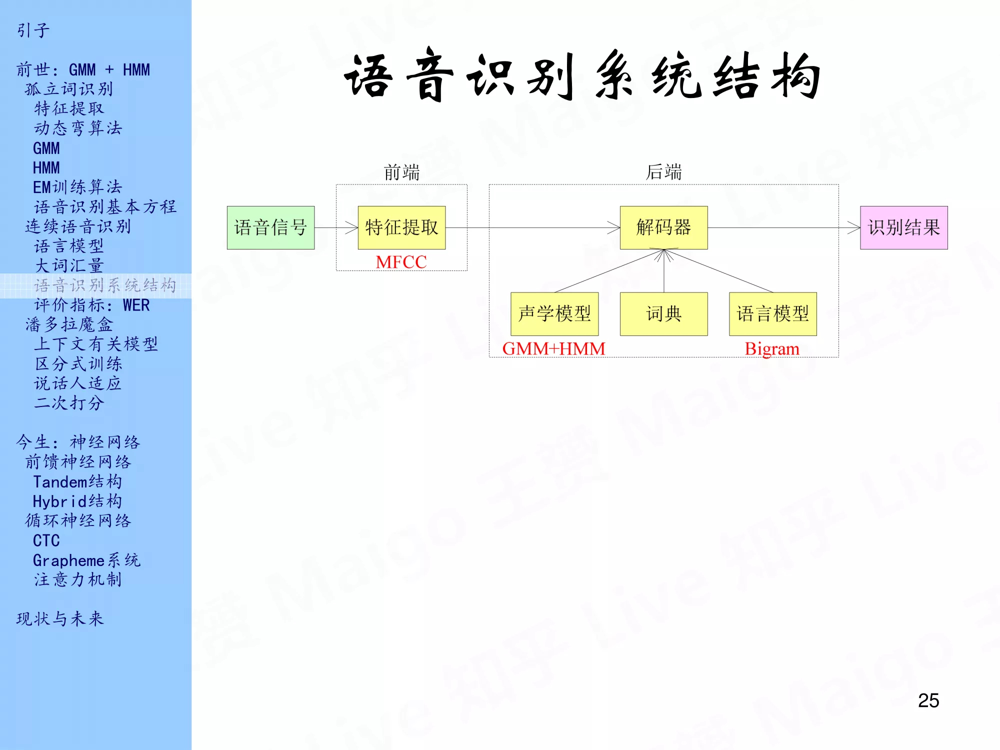

### 评价指标：词错误率 WER WORD ERROR RATE

- 标准答案与识别结果对齐

- 插入，删除，替换错误总数/标准答案的长度
- 对齐应使得错误数最少

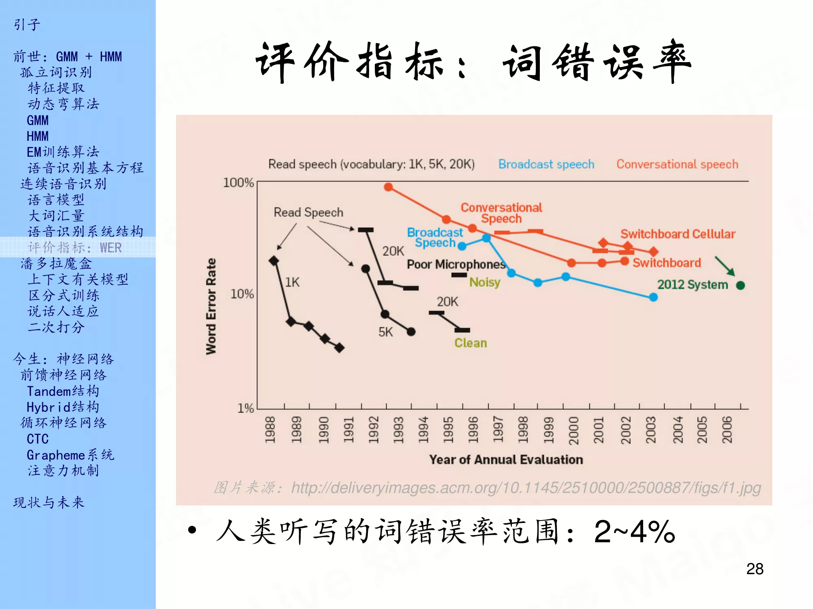

### 本章答疑

- 声学特征为什么不超过13维度？
MFCC 特征，维度越高，幅度越小。

- GMM的循环训练？

## 潘多拉魔盒

1990～2010年的框架没有变化

### 上下文有关的模型

先看一个例子，Five 和 Nine 的HMM模型。

FIVE = f123 ai123 v123
NINE = n1n2n3 ai1ai2ai3 n1n2n3
这两个ai其实因为鼻音的问题，发音不一样，并且n的发音也是不一样的。

加入了上下文音素以后，状态数爆炸了。不光要考虑自身，还要考虑上下文。这意味着，即使是同一个音素，因为上下文的不同，也需要将他们看作是不同的音素，伴随着音素而来的状态也就爆炸了。

为了防止状态组合爆炸，引入聚类的方法。

ai(m,n) 和 ai(n,n) 虽然上下文不一样，但是可以被聚类为同一个类型的音素。

### 区分训练

EM 算法的缺陷，最大化了YES模型概率（P（X|W）=P（语音|文本）），却同时导致它的竞争者NO的概率P（X|W‘）变得更大了。

区分式训练，让一个大，一个小。
1. 训练最佳的系统（路径）。
2. 近似的句子，概率变小。

### 说话人适应

收集特定的人的数据，来训练。

说话人适应
使用所有人的数据，使用的时候，将特征参数的特征向量整体评议，不断的变化。

### 二次打分

使用 bigram。
使用更好的模型，重新打分。

---

## 神经网络

### 什么是神经网络？
略

### Tandem结构

Tandem是双人自行车的意思。将**特征提取**这个步骤，使用DNN来代替。

输入是 **帧的滤波器输出**或者是**波形**。
输出是上下文有关音素的分布，或者说是什么上下文的有关音素。标准答案从GMM+HMM系统来，使用该系统凑合一下。
类似autoencoder，使用中间的瓶颈层的参数，作为该输入的特征向量。

### Hybrid 结构

使用DNN代替特征提取。

原先的GMM，能够获得P（特征|状态），意思是说，一些相似的特征，可以通过GMM聚拢类似的特征向量，而获得状态，如果写成状态的形式，就是通过GMM，可以让我们获得在已知一堆状态的情况下，某一特征的概率。如果有某一个状态作条件的情况下，这个特征概率巨大，那么可以说，这个特征属于该状态。

现在，DNN提供了P（状态|输入），可以经过贝叶斯的转换，获得模型。

## 循环神经网络

HMM 对于上下文的能力有限制。

所以有了recurrent neural network，可以考虑到时间的上下文。

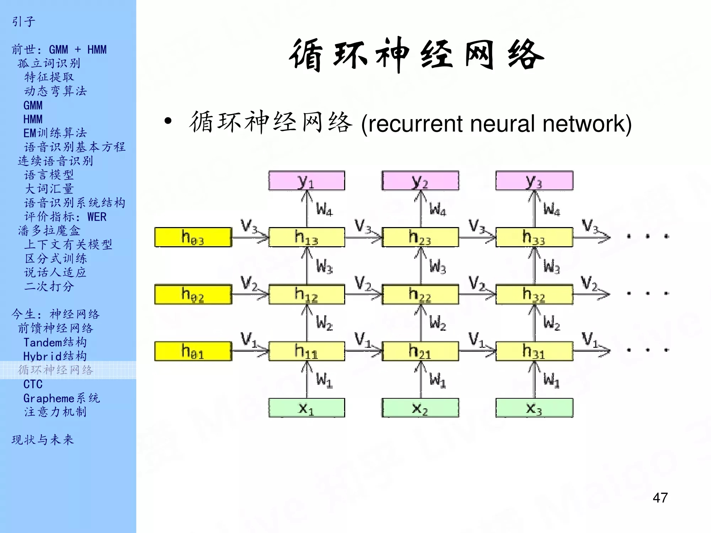

h 中，第一个下标，代表时间，第二个，代表层次。亮黄色的是初始值，可以全部设定为零。

如果观察y3，可以发现它能够接受到x123的信息，但是y1只能接受x1的信息，而无法知道获得未来的x23信息，于是诞生了双向循环神经网络。

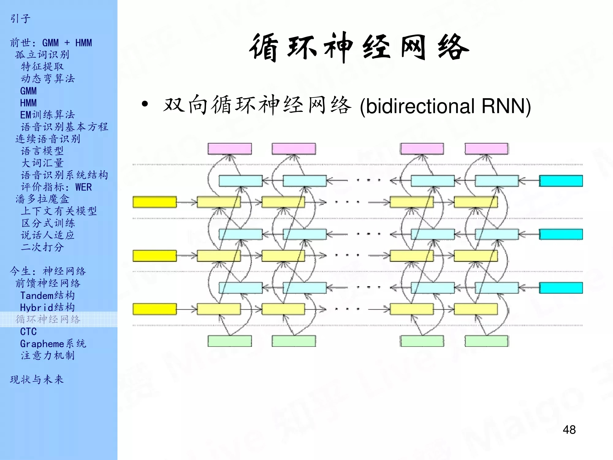

缺点：

梯度弥散或是爆炸的问题

为什么留着HMM？HMM提供时间，每个音素和状态的对应关系，还需要考虑转移概率。

### CTC

修改loss function的rnn网络。

不再进行逐帧的判别。

大部分帧输出为空，只有小部分的输出为音素。只要求输出音素串起来，和标准答案是一致的，但不要求位置。

例子

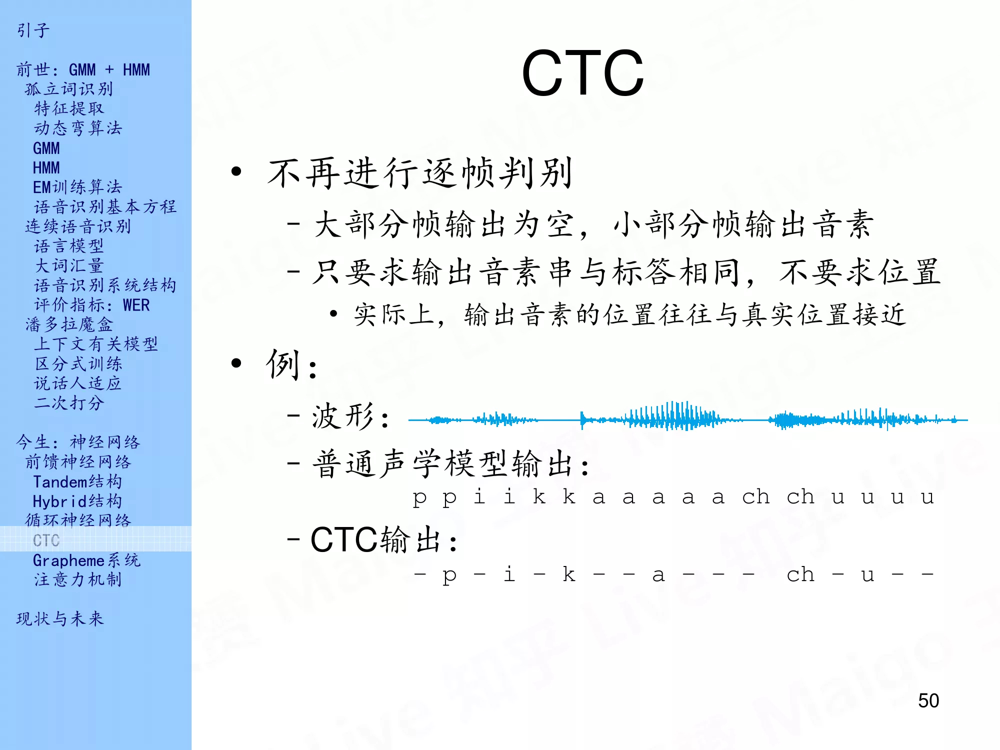

每个音素输出只有一项，剩下的都是空白，只要求输出的音素连起来，是p-i-k-a-ch-u就好，而且不要求位置，例如a，就在中间。chu就考后。

训练方式：

目标函数，所有能够缩成标答音素的总概率。

动态规划算法计算总概率。

解码：

仍需要词典和语言模型

### Grapheme系统

将词典和语音模型给吃掉了。词典，每个单词如何发音，找到字符和音素之间的对应关系（发音规则）。语言模型，单词和单词的连接，哪个单词之间的连接比较大（上下文）。CTC 是可以全部完成的，它很简洁，不需要语言知识，不怕生词，可以端到端。（因为只有一个模块，所以不会出现，训练好了这个，另外一个不好了）

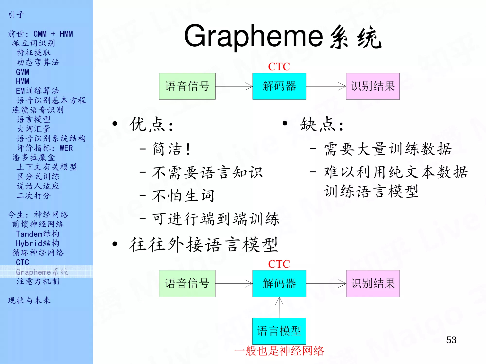

#### 注意力机制

主动选择输入哪些帧，并从中一定要输出一个音素或者字符。

它有编码器和解码器组成。

编码器：波形 - 双向神经网络 - 一帧帧的向量（特征提取）

解码器：初始状态s1，会输出一个概率分布，即s1下面的第一条曲线，表示下一步想关注输入中的哪个部分。考虑到自己的状态s1，还有关注的输入帧，例如123，判断出这是什么音素/字符。

可以解决语序不单调的问题。

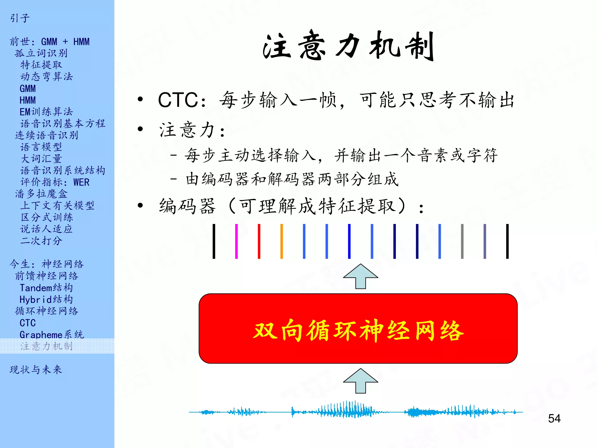

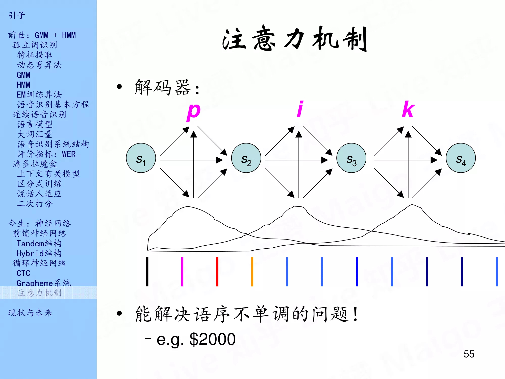

kaldi加入神经网络的升级版（18年的信息，后续kaldi是否更新未知）：https://github.com/srvk/eesen 

# Q&A

- 什么是状态？

帧，提取出向量，相似向量经过GMM被归为一类，就叫做状态。

- 音素和状态？

通常，一个音素对应三个状态（或五个状态）。